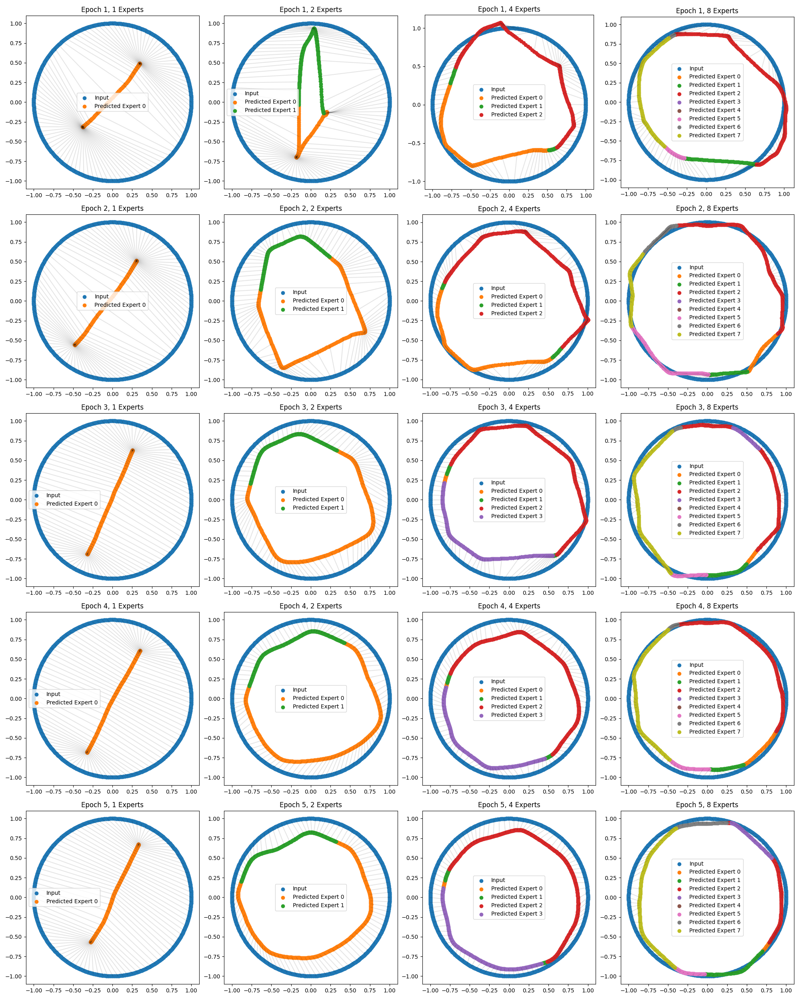

# Mixture of Experts Autoencoder (MoE-AE)

This repo combines Mixture of Experts (MoE) and Autoencoders (AE) for representation learning.
The goal is to learn low dimensional manifold representations of higher dimensional data.
Currently, this is a proof of concept using synthetic data, illustrating the basic principles.

## Setup & Usage

The code is written in Python 3.10 and uses PyTorch 2.2. The setup is as any other Python project:

```bash
git clone https://github.com/simon-ottenhaus/moe-autoencoder.git
cd moe-autoencoder
python -m venv .venv
source .venv/bin/activate
pip install -r requirements.txt

# train the models (is pre-set to GPU training)
python train_representations.py
```

Then open [analyze_data.ipynb](analyze_data.ipynb) and run all the cells to see the results in the [figures](figures) folder.

## Problem statement

The task is to find `1D` representations of `2D` data, where a continous `1D` representation is analytically know but hard to represent in a neural network.
The considered functions are: `circle`, `spiral` and `figure8`, the data is generated as follows:

```python
# Psuedo code
def generate_circle(n_samples):
    parameter = np.linspace(0, 2*np.pi, n_samples)
    return np.cos(parameter), np.sin(parameter)

def generate_spiral(n_samples):
    parameter = np.linspace(0, 2*np.pi * 3, n_samples)
    return parameter*np.cos(parameter), parameter*np.sin(parameter)

def generate_figure8(n_samples):
    parameter = np.linspace(0, 2*np.pi, n_samples)
    return np.sin(parameter), np.cos(parameter)
```

## Vanilla Autoencoder

The 'vanilla' Autoencoder is defined as follows:

```python
# Psuedo code
class Autoencoder(nn.Module):
    def __init__(self, input_dim, hidden_dim, output_dim):
        super().__init__()
        self.encoder = ... # input_dim -> hidden_dim
        self.decoder = ... # hidden_dim -> output_dim

    def forward(self, x):
        x = self.encoder(x) # input_dim -> hidden_dim
        x = self.decoder(x) # hidden_dim -> output_dim
        return x

vanilla_ae = Autoencoder(input_dim=2, hidden_dim=1, output_dim=2)
```

After `5` epochs of training the vanilla Autoencoder, the model fails to find a hidden `1D` representation of the `2D` data:


The blue dots represent the original `2D` input data ($x$), the orange dots represent the `2D` output data ($\hat{x}$). Lines are drawn between corresponding points.
The vanilla Autoencoder is not able to find a `1D` representation of the `2D` data and minimized the reconstruction loss by generating some kind of average of the input data.

## Mixture of Experts Autoencoder

One approach to overcome this limitation would be to split up the data into different chunks, that can be represented by an Autoencoder. Doing this manually needs a domain knowledge about the data.
The Mixture of Experts (MoE) approach can find these chunks automatically during training.

The MoE-AE is defined as follows:

```python
# Psuedo code
class MoE_Autoencoder(nn.Module):
    def __init__(self, input_dim, hidden_dim, output_dim, n_experts):
        super().__init__()
        self.router = Router(input_dim, n_experts) # input_dim -> n_experts
        self.experts = [ # create multiple 'expert' Autoencoders
            Autoencoder(input_dim, hidden_dim, output_dim) for _ in range(n_experts)
        ]

    def forward(self, x):
        # the router chooses which expert to use for each input
        gate = self.router(x) # input_dim -> n_experts, is a probability distribution
        output = torch.zeros_like(x)
        for i, expert in enumerate(self.experts):
            # soft-add the output of each expert, weighted by the router
            output += gate[:, i].unsqueeze(1) * expert(x) 
        return output

class Router(nn.Module):
    def __init__(self, input_dim, n_experts):
        super().__init__()
        self.fc = ... # input_dim -> n_experts
        self.softmax = nn.Softmax(dim=1)

    def forward(self, x):
        x = self.fc(x) # input_dim -> n_experts
        x = self.softmax(x) # input_dim -> n_experts
        return x

moe_ae = MoE_Autoencoder(input_dim=2, hidden_dim=1, output_dim=2, n_experts=...)
```

After `5` epochs of training the MoE-AE, the model is able to find a hidden `1D` representation of the `2D` data. The followin plot shows the effects of different numbers of experts. The left most column using one expert is equivalent to the vanilla Autoencoder.


The blue dots are again the original `2D` input data ($x$), the colored dots are the `2D` output data ($\hat{x}$) of the MoE-AE. Lines are drawn between corresponding points. Each $\hat{x}$ is colored according to the most probable expert.

In the case of two experts, a clear decision boundary of the router can be seen. Hinger number of experts lead to better representations of the data but introduce more decision boundaries/chunking of the data.

## Representation evolution during training

To understand how the MoE-AE is able to find representations, the following plot shows the evolution of the representations during training:



The model is run after each epoch and the resulting representations are plotted (row: epoch, column: number of experts). The color scheme is the same as in the previous plots.

## Conclusion

This toy example illustrates that the MoE-AE approach is able to find low-dimensional representations of high-dimensional data, where the vanilla Autoencoder fails. Future work will include higher dimensional data and constrained autoencoders.